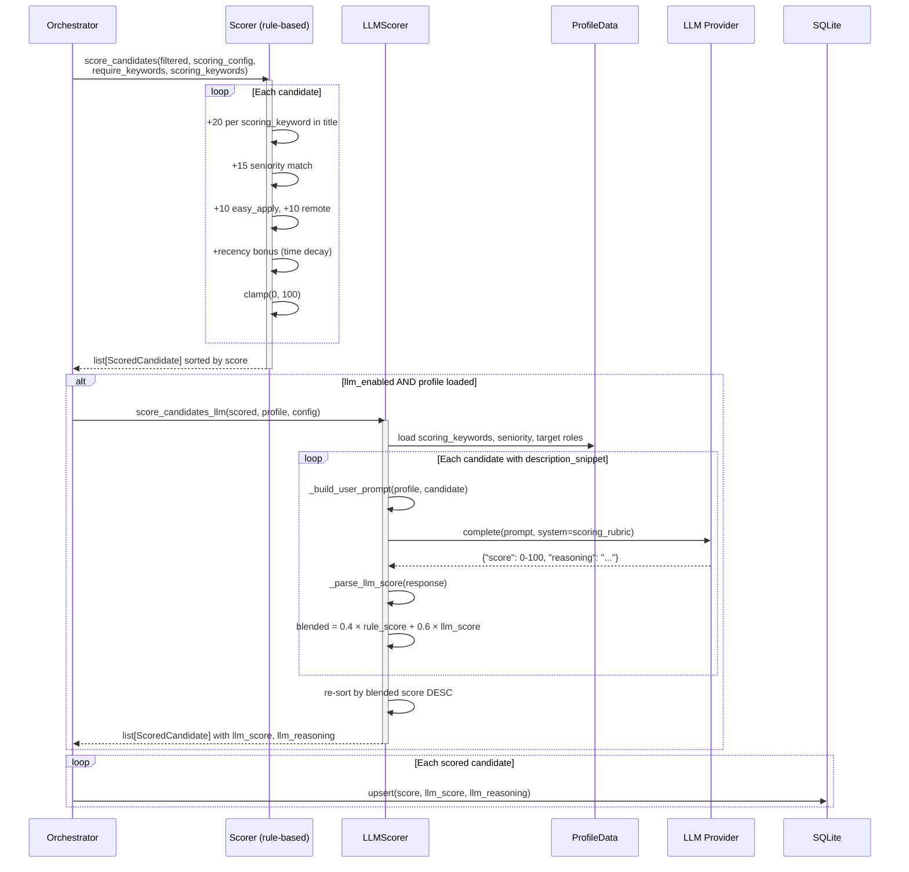

# Architecture Design
# jobs-search-engine

**Version:** 0.2 (M10 — LLM-Assisted Scoring)
**Date:** 2026-03-02

---

## 1. Guiding Principles

1. **Search ≠ Apply** — This project is read-only. No side effects beyond writing to our own DB.
2. **Platform-agnostic core** — Filter chain, scoring, dedup, and quota logic know nothing about LinkedIn or DOM.
3. **Testable by default** — Any module that doesn't need a browser must not import one.
4. **Fail safe** — A bad card parse logs a warning and continues; it never crashes the run.
5. **Config-driven** — Behavior changes via YAML, not code changes.

---

## 2. System Context

```
┌─────────────────────────────────────────────────────┐
│                    Caller (CLI / cron)               │
└───────────────────────────┬─────────────────────────┘
                            │  runs
                            ▼
┌─────────────────────────────────────────────────────┐
│               jobs-search-engine (this project)      │
│                                                      │
│  Config ──► Orchestrator ──► [Platform Adapters]     │
│                    │              ↓                  │
│                    │         Raw JobCards            │
│                    ▼              ↓                  │
│             Filter Chain ◄────────┘                  │
│                    │                                 │
│                    ▼                                 │
│             Scored Candidates                        │
│                    │                                 │
│                    ▼                                 │
│              SQLite DB / stdout (dry-run)            │
└─────────────────────────────────────────────────────┘
                            │  reads
                            ▼
┌─────────────────────────────────────────────────────┐
│           Downstream apply project (separate)        │
└─────────────────────────────────────────────────────┘
```

---

## 3. Module Structure

```
jobs-search-engine/
├── config/
│   ├── settings.yaml              # User-facing configuration
│   └── profile.yaml               # Resume-derived profile (scoring_keywords, seniority, etc.)
├── src/
│   ├── core/
│   │   ├── schemas.py             # JobCandidate, ScoredCandidate, SearchRunResult (Pydantic)
│   │   ├── config.py              # Config models + loader (Pydantic)
│   │   └── db.py                  # SQLite connection + table definitions + migrations
│   ├── pipeline/
│   │   ├── orchestrator.py        # Main entry point: loads config, runs searches, writes output
│   │   ├── matcher.py             # Filter chain: exclude → dedup → already_seen → score
│   │   ├── quota_manager.py       # Daily quota tracking + enforcement
│   │   ├── scorer.py              # Relevance scoring (rule-based)
│   │   └── llm_scorer.py          # LLM-assisted scoring (prompt builder, parser, blending)
│   ├── platforms/
│   │   ├── base.py                # Abstract PlatformAdapter interface
│   │   ├── linkedin/
│   │   │   ├── adapter.py         # Implements PlatformAdapter; wires searcher + browser
│   │   │   ├── searcher.py        # URL building, pagination, lazy-scroll loop
│   │   │   ├── parser.py          # DOM → JobCandidate (all selector logic here)
│   │   │   └── selectors.py       # Selector constants with fallback lists
│   │   └── (glassdoor/, indeed/)  # Future adapters
│   ├── profile/
│   │   ├── extractor.py           # PDF → plain text (pymupdf)
│   │   ├── llm_analyzer.py        # Facade: analyze_resume() → ProfileData
│   │   ├── schema.py              # ProfileData Pydantic model
│   │   ├── generator.py           # ProfileData → settings.yaml dict
│   │   └── llm/
│   │       ├── base.py            # LLMProvider ABC + SYSTEM_PROMPT
│   │       ├── anthropic.py       # Claude provider (claude-sonnet-4-20250514)
│   │       ├── gemini.py          # Gemini provider (gemini-2.5-flash, google-genai SDK)
│   │       ├── openai.py          # GPT-4o-mini provider
│   │       └── ollama.py          # Local Ollama provider (llama3, OpenAI-compat API)
│   └── browser/
│       ├── session.py             # Patchright browser init, cookie loading
│       └── actions.py             # Reusable: scroll, wait_for_cards, safe_text
├── scripts/
│   ├── benchmark_llm_scoring.py   # Provider comparison benchmark (Gemini vs Opus)
│   └── extract_cookies.py         # Browser cookie export helper
├── tests/
│   ├── unit/
│   │   ├── test_url_builder.py    # URL construction (pure, no browser)
│   │   ├── test_parser.py         # Parser with HTML fixtures (no browser)
│   │   ├── test_matcher.py        # Filter chain logic
│   │   ├── test_quota_manager.py  # Quota: reset, gate, increment
│   │   ├── test_scorer.py         # Rule-based scoring logic
│   │   ├── test_llm_scorer.py     # LLM scorer: prompt building, parsing, blending
│   │   ├── test_llm_providers.py  # Provider registry + all 4 provider adapters
│   │   ├── test_llm_analyzer.py   # Resume analysis facade + response parsing
│   │   ├── test_profile_schema.py # ProfileData validation, YAML round-trip
│   │   └── test_profile_extractor.py  # PDF text extraction
│   ├── integration/
│   │   └── test_search_pipeline.py  # Full search with mock adapter
│   └── fixtures/
│       └── linkedin_results_page.html  # Saved HTML for parser tests
├── tasks/
│   └── todo.md                    # Milestone tracking
├── docs/
│   ├── PRD.md                     # This document's companion
│   ├── ARCHITECTURE.md            # This document
│   └── lessons-applied.md         # Lessons from previous project
├── main.py                        # CLI entry point
└── pyproject.toml
```

---

## 4. Key Interfaces

### 4.1 `PlatformAdapter` (abstract base)

```python
class PlatformAdapter(ABC):
    """One implementation per job platform."""

    @abstractmethod
    async def search(self, config: SearchConfig) -> list[JobCandidate]:
        """
        Execute a single keyword search and return raw (unfiltered) candidates.
        Handles pagination, scroll, and rate limiting internally.
        """
        ...

    @property
    @abstractmethod
    def platform_id(self) -> str:
        """e.g. 'linkedin', 'glassdoor'"""
        ...
```

### 4.2 `JobCandidate` (core schema)

```python
class JobCandidate(BaseModel):
    model_config = ConfigDict(frozen=True)

    external_id: str           # Platform-specific job ID
    platform: str              # "linkedin", "glassdoor", etc.
    title: str                 # Cleaned title (no \n duplicates)
    company: str               # Company name ("" if unparseable)
    location: str              # Location text
    url: str                   # Absolute canonical URL
    is_easy_apply: bool        # True if platform confirmed easy/quick apply
    workplace_type: str        # "remote" | "hybrid" | "onsite" | ""
    posted_time: str           # Human-readable: "2 days ago"
    description_snippet: str   # "" unless description fetch is enabled
    found_at: datetime         # When this candidate was collected
```

> **Note:** `score` is not on `JobCandidate` — it lives on the `ScoredCandidate` wrapper
> (see ADR-005). `ScoredCandidate` holds `candidate: JobCandidate`, `score: float`,
> `llm_score: float | None`, and `llm_reasoning: str`.

### 4.3 `FilterChain` (pipeline step)

The matcher applies filters **in order**. Each filter receives `list[JobCandidate]` and returns a subset.

```
Input candidates
    │
    ▼ ExcludeKeywordsFilter(title, case_insensitive)
    ▼ PositiveKeywordsFilter(title OR snippet, optional)
    ▼ DeduplicationFilter(platform + external_id, in-memory within run)
    ▼ AlreadySeenFilter(DB lookup, configurable TTL in days)
    │
Output: filtered candidates → Scorer
```

Each filter is a callable `(candidates: list[JobCandidate]) -> list[JobCandidate]`.
Filters are composable and independently testable.

### 4.4 `QuotaManager`

```python
class QuotaManager:
    def can_search(self, platform: str) -> bool: ...
    def record_search(self, platform: str) -> None: ...
    def remaining_candidates(self, platform: str) -> int: ...
    def record_candidates(self, platform: str, count: int) -> None: ...
```

State stored in `quota` table in SQLite. Auto-resets when `date != today`.

---


## 5. Scoring Pipeline (Sequence Diagram)



---

## 6. Database Schema (SQLite)

### `candidates` table

```sql
CREATE TABLE IF NOT EXISTS candidates (
    id                  INTEGER PRIMARY KEY AUTOINCREMENT,
    external_id         TEXT    NOT NULL,
    platform            TEXT    NOT NULL,
    title               TEXT    NOT NULL,
    company             TEXT    NOT NULL DEFAULT '',
    location            TEXT    NOT NULL DEFAULT '',
    url                 TEXT    NOT NULL,
    is_easy_apply       INTEGER NOT NULL DEFAULT 0,
    workplace_type      TEXT    NOT NULL DEFAULT '',
    posted_time         TEXT    NOT NULL DEFAULT '',
    description_snippet TEXT    NOT NULL DEFAULT '',
    score               REAL    NOT NULL DEFAULT 0.0,
    llm_score           REAL,                            -- NULL = not LLM-scored
    llm_reasoning       TEXT    NOT NULL DEFAULT '',      -- 1-2 sentence LLM explanation
    status              TEXT    NOT NULL DEFAULT 'new',
    found_at            TEXT    NOT NULL,
    UNIQUE(external_id, platform)
);
```

> **Migration note:** `llm_score` and `llm_reasoning` are added via safe
> `ALTER TABLE ADD COLUMN` in `init_db()` — existing databases are upgraded transparently.

### `quota` table

```sql
CREATE TABLE IF NOT EXISTS quota (
    platform      TEXT NOT NULL,
    date          TEXT NOT NULL,
    searches_run  INTEGER NOT NULL DEFAULT 0,
    candidates_found INTEGER NOT NULL DEFAULT 0,
    PRIMARY KEY (platform, date)
);
```

### `search_runs` table

```sql
CREATE TABLE IF NOT EXISTS search_runs (
    id            INTEGER PRIMARY KEY AUTOINCREMENT,
    platform      TEXT NOT NULL,
    keyword       TEXT NOT NULL,
    filters_json  TEXT NOT NULL,
    raw_count     INTEGER NOT NULL,
    filtered_count INTEGER NOT NULL,
    started_at    TEXT NOT NULL,
    finished_at   TEXT NOT NULL
);
```

---

## 7. Configuration Schema (`settings.yaml`)

```yaml
database:
  path: data/candidates.db

profile_path: config/profile.yaml   # Resume-derived profile for LLM scoring

quotas:
  linkedin:
    max_searches_per_day: 2
    max_candidates_per_day: 150

browser:
  cookies_path: config/linkedin_cookies.json
  timeout_ms: 30000

searches:
  - keyword: "Senior Python Engineer"
    platform: linkedin
    filters:
      geo_id: 92000000           # Worldwide
      workplace_type: [remote]
      experience_level: [senior, director]
      easy_apply_only: true
      max_pages: 3
    exclude_keywords:
      - Junior
      - PHP
      - Ruby
      - Frontend
      - "React Native"
    require_keywords: []          # Optional: title must contain one of these
    scoring_keywords:             # LLM-extracted tech skills for title matching + LLM context
      - Python
      - FastAPI
      - PostgreSQL
    fetch_description: false      # Enable side-panel description extraction

  - keyword: "Staff Backend Engineer Python"
    platform: linkedin
    filters:
      geo_id: 92000000
      workplace_type: [remote]
      easy_apply_only: true
      max_pages: 2

scoring:
  title_match_bonus: 20           # Points for each scoring_keyword hit in title
  seniority_match_bonus: 15       # Points for matching seniority level
  easy_apply_bonus: 10
  remote_bonus: 10
  recency_weight: 0.3             # Higher = prefer recent posts
  # LLM-assisted scoring (M10)
  llm_enabled: false              # Set true to enable dual-scorer pipeline
  llm_provider: gemini            # gemini | anthropic | openai | ollama
  llm_model: null                 # null = provider default (e.g. gemini-2.5-flash)
  rule_weight: 0.4                # Weight for rule-based score in blending
  llm_weight: 0.6                 # Weight for LLM score (must sum to 1.0 with rule_weight)
```

---

## 8. Anti-Detection Constraints (Hard Rules)

These are non-negotiable for LinkedIn and any browser-based platform:

| Rule | Enforcement |
|------|-------------|
| `headless=False` always | Hardcoded in `browser/session.py`; no config override |
| Random delays between ALL actions | `actions.py` exposes `random_sleep(min, max)` only |
| Single browser session per run | `session.py` creates one context; adapter receives it |
| Cookie auth only | `session.py` loads from file; no login flow anywhere |
| patchright (not playwright) | Listed as only browser dep in `pyproject.toml` |

---

## 9. Testing Strategy

| Layer | Approach | Tools |
|-------|----------|-------|
| URL builder | Pure unit tests — no browser | pytest |
| Parser | Tests against saved HTML fixtures | pytest + BeautifulSoup (for fixture gen) |
| Filter chain | Pure unit tests with synthetic candidates | pytest |
| Scorer (rule-based) | Pure unit tests with synthetic inputs | pytest |
| LLM scorer | Prompt building, response parsing, blending logic | pytest + mock LLM |
| LLM providers | Registry, all 4 adapters, system prompt override | pytest + mock SDKs |
| Profile extraction | PDF → text, schema validation, YAML round-trip | pytest + mock pymupdf |
| Profile analyzer | Response parsing (JSON, markdown), facade | pytest + mock provider |
| Quota manager | Unit tests with in-memory SQLite | pytest |
| Platform adapter | Integration tests with mock `page` object | pytest + AsyncMock |
| Full pipeline | E2E dry-run with saved HTML | pytest |

No test should require a live browser or internet connection.

---

## 10. Architecture Decision Records

### ADR-001: SQLite over file-based quota
**Decision:** Use SQLite for all state (quota, candidates, run history).
**Rationale:** File-based JSON quota is fragile (concurrent write corruption, slow O(n) scans for dedup). SQLite is zero-dependency, ACID, and O(1) by indexed `(external_id, platform)`.
**Trade-off:** Slightly more setup than a JSON file.

### ADR-002: patchright over vanilla playwright
**Decision:** Use `patchright` as the browser automation library.
**Rationale:** Vanilla Playwright leaks CDP fingerprint markers that LinkedIn detects. Patchright patches these vectors. Confirmed in production by the previous project.
**Trade-off:** Patchright is a third-party fork; must monitor for upstream divergence.

### ADR-003: Adapter pattern for platforms
**Decision:** Each platform is a class implementing `PlatformAdapter`.
**Rationale:** LinkedIn-specific logic (geoId, f_AL, DOM selectors) must not leak into core pipeline. Adding Glassdoor/Indeed should not require touching the filter chain.
**Trade-off:** Small amount of boilerplate per platform.

### ADR-004: Filter chain as composable callables
**Decision:** Each filter is a standalone function/class, not a monolithic `match()` function.
**Rationale:** Enables independent testing of each filter, easy reordering, and addition of new filters without regression risk.

### ADR-005: ScoredCandidate wrapper over mutable score field
**Decision:** `JobCandidate` is frozen; scoring is on a `ScoredCandidate(candidate=..., score=...)` wrapper.
**Rationale:** Scoring happens after filtering, so score is not part of the parsed data. Two options: (a) mutable score field, (b) `ScoredCandidate` wrapper. Chose wrapper to keep the core schema frozen.

### ADR-006: scoring_keywords over full resume text
**Decision:** Use 5–15 LLM-extracted `scoring_keywords` (technical skills) instead of sending the full resume text to the scoring pipeline.

**Context:** The scoring pipeline has two layers — rule-based and LLM-assisted. Both need to know the candidate's skills to evaluate job fit. The question is whether to pass the full resume (~2–5K tokens) or a compact keyword list.

**How scoring_keywords are used:**
- **Rule-based scorer:** substring match against job title — each `scoring_keyword` hit adds +20 points. Fast, deterministic, zero-cost.
- **LLM scorer:** keywords sent as "Core skills" in the structured prompt alongside `description_snippet`, target roles, and seniority. The LLM evaluates fit holistically.

**Why keywords are the right abstraction:**

For the rule-based layer:
- Title matching requires discrete terms, not prose. Full resume text would need NLP/embedding to be useful — overkill for a heuristic that contributes 40% of the blended score.
- Keywords are predictable and testable: `"Python" in title` is deterministic.

For the LLM layer:
- The LLM already receives the full `description_snippet` (up to ~1K tokens) plus structured profile context (seniority, target roles, workplace preference). It has enough signal to evaluate fit.
- Full resume text would add 2–5K tokens **per candidate** — at 10–50 candidates per run, this is a significant cost and latency increase for marginal accuracy gain.
- Structured data (skills list + seniority + target roles) gives the LLM a cleaner signal than raw prose. Less noise → more focused evaluation.

**Trade-offs acknowledged:**
- Information loss during keyword extraction (mitigated by the LLM's contextual inference from structured profile fields).
- No semantic matching in the rule-based layer (e.g., "TypeScript" won't boost a "Node.js" title). This is acceptable because the LLM layer handles semantic matching when enabled.

**Verdict:** Current design is sound. The dual-layer approach lets each scorer operate at its optimal abstraction level — keywords for fast heuristics, structured profile for LLM evaluation. The 0.4/0.6 blending ensures the LLM's semantic understanding dominates while the rule-based layer provides a stable baseline.
